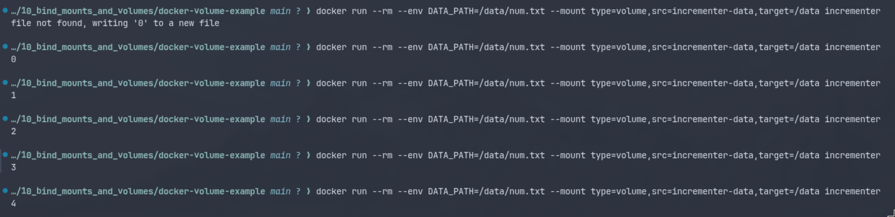

# Bind Mounts and Volumes

Sometimes our containers need to be stateful in some capacity. Sometimes our containers need to read and write to the host. This is fundamentally at odds with the idea of a stateless, able-to-create-and-destroy-anytime container that we've been adhering to thusfar. So what are we to do?

Enter volumes and bind mounts. Both of these are methods of reading and writing to the host but with slight-but-important differences of when to use which.

## Bind Mounts

Bind mounts allow you to mount files from your host computer into your container. This allows you to use the containers a much more flexible way than previously possible: you don't have to know what files the container will have _when you build it_ and it allows you to determine those files _when you run it_.

> You can use the `nginx` container directly to test configurations and serve content directly from it.
> ```bash
>  # from the root directory of your Astro app (example)
> docker run --mount type=bind,source="$(pwd)"/dist,target=/usr/share/nginx/html -p 8080:80 nginx:latest
> ```

- `--mount` flag: to identify that something from the host will be mounted to the container.
- `bind` and `volume` are the two mount types we will talk about. We're using bind to mount in some piece of already existing data from the host.
- `source` and `target` both need to be absolute paths, hence `$(pwd)/dist` is used (to get the **P**resent **W**orking **D**irectory to make it an absolute path).
- The target is where we want those files to be mounted in the container. We're mounting it to `/usr/share/nginx/html`, which is what NGINX is expecting.

Again, it's preferable to bake your own container so you don't have to ship the container and the code separately; you'd rather just ship one thing that you can run without much ritual nor ceremony. But this is a useful trick to have in your pocket. It's kind of like serve but with real NGINX.

--- 

## Volumes

Bind mounts are great for when you need to share data between your host and your container as we just learned. Volumes, on the other hand, are so that your containers can maintain state between runs. So if you have a container that runs and the next time it runs it needs the results from the previous time it ran, volumes are going to be helpful. Volumes can not only be shared by the same container-type between runs but also between different containers.

The key here is this:
- bind mounts are file systems managed the host. They're just normal files in your host being mounted into a container.
- Volumes are different because they're a new file system that Docker manages that are mounted into your container.
- These Docker-managed file systems are not visible to the host system (they can be found but it's designed not to be.)

> So without having to rebuild your container you can try:
> ```
> docker run --rm --env DATA_PATH=/data/num.txt --mount type=volume,src=incrementor-data,target=/data incrementor
>```
> This is for the `docker-volume-example` project in this directory. You can test this out.

- `--rm` flag: to remove the container when done running.
- `--env` flag: to pass in environment variables to the container.
- `--mount` flag: to identify that something from the host will be mounted to the container.
- `volume` is the type of mount we're performing.
- `src` is the name of the volume - you can use any name here, docker will create a volume with this name on your disk - you can check it using `docker volume ls`

Here is the example output of the `docker-volume-example` project: 
